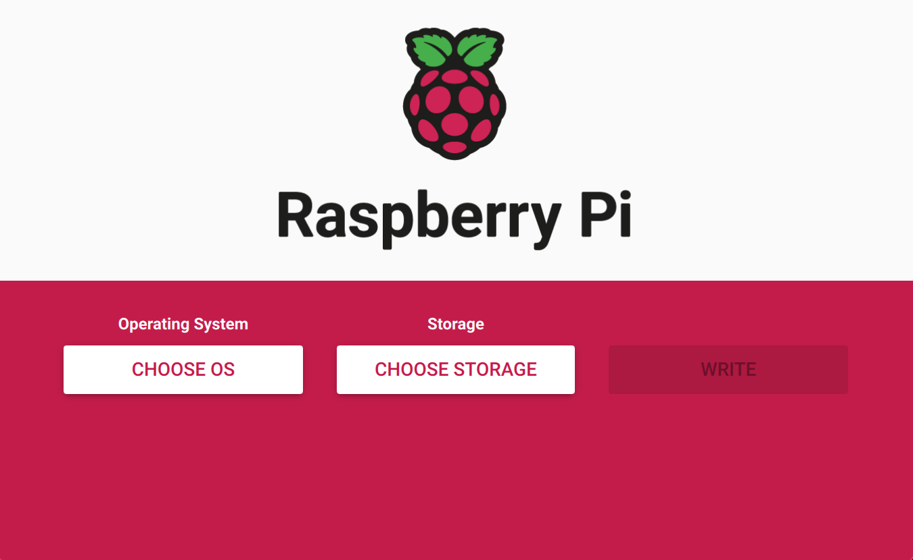

# bramble-box
I recently developed an interest in setting up a home lab to tinker with. I wanted a low cost solution to host some home automation tools, have a place to play with new pieces of software, and experiment with container management. There are some good tutorials out there, but none of them did what I wanted, or if they did, they failed to explain what was going on at each step, meaning I was just copying and pasting instead of actually learning. Enter the **Raspberry Pi Bramble Box** project. There are no commissions on this project, just a modern walkthrough that explains what is happening at each step.

[TODO] - Add photo

Parts List:
- 4x - [Raspberry Pi 4B 4GB](https://www.amazon.com/dp/B07TC2BK1X?psc=1&ref=ppx_yo2ov_dt_b_product_details)
- 1x - [Acrylic cluster case](https://www.amazon.com/dp/B07MW3GM1T?psc=1&ref=ppx_yo2ov_dt_b_product_details)
- 1x - [USB Power Station](https://www.amazon.com/dp/B00P936188?psc=1&ref=ppx_yo2ov_dt_b_product_details)
- 2x - [USB-A to USB-C cables (3 pack)](https://www.amazon.com/dp/B092ZS6SJG?psc=1&ref=ppx_yo2ov_dt_b_product_details)
- 1x - [USB to RJ45 connector](https://www.amazon.com/dp/B09GRL3VCN?psc=1&ref=ppx_yo2ov_dt_b_product_details)
- 1x - [USB to SATA cable](https://www.amazon.com/dp/B07F7WDZGT?psc=1&ref=ppx_yo2ov_dt_b_product_details)
- 1x - [500 GB 2.5" SSD](https://www.amazon.com/dp/B07XZLN9KM?psc=1&ref=ppx_yo2ov_dt_b_product_details)
- 1x - [Netgear 5 port managed POE switch](https://www.amazon.com/dp/B08LR18SC4?psc=1&ref=ppx_yo2ov_dt_b_product_details)
- 1x - [Cat6A cables (5 pack)](https://www.amazon.com/dp/B00HEM54DK?psc=1&ref=ppx_yo2ov_dt_b_product_details)
- 1x - [Mini HDMI to HDMI cable](https://www.amazon.com/dp/B08ZY3RR9X?psc=1&ref=ppx_yo2ov_dt_b_product_details)

**Total Cost:** $482.04

**Note:** This guide assumes you have two Micro SD cards (16gb minimum), a keyboard, and some sort of screen that accepts HDMI input. If you don't have those, you should add those to your list.

---

## Step 1 - Assembly

Physically building the device is pretty straight forward. Follow the guide that came with the case. 

For the fan wires: 
1. Hold the part of the Pi with the USB ports and RJ45 jack against you.
2. Find the GPIO (the two columns of pins on your right).
4. Plug the red wire into the pin one closer to you than the far right corner.
5. Plug the black wire into the pin one closer to you than the red wire.
   
I stacked the power brick as my bottom, then the SSD, then the cluster with the switch attached vertically and then bundled it all with some velcro straps. You can plug in all of your CAT6 cables now, but only run power to whichever Pi you want to have as your main (head) unit. I went with the bottom one. You should also connect the SSD, and HDMI to the same one.

---

## Step 2 - The Head Unit



The first thing that we need to do is set up our head unit. This will be our main controller that will dictate what the other nodes do.

#### 2.1 - Installing Raspberry Pi OS Lite
1. Download the [Raspberry Pi Imager](https://www.raspberrypi.org/software/) and install it.
2. Insert your Micro SD card into your computer.
3. Open the Raspberry Pi Imager and select the 64-bit Raspberry Pi OS Lite. You may need to go into the "other" section to find it.
4. Select your SD card after clicking "Choose Storage".
5. Select the gear in the bottom right hand corner.
    - Enable and set the hostname to "cluster.local."
    - Enable SSH using password authentication.
    - Enable and set the username and password to something that you will remember. I will use "pi" and "raspberry" for this guide.
    - Enable and configure your "wireless LAN" settings.
    - Set locale settings as necessary.
6. Write the image to your SD card.
7. Remove your SD card and insert it into your Pi.
8. Plug in your Pi and wait for it to boot up.

#### 2.2 - SSH and Connect to the Switch Over Ethernet
1. Load your command line interface of choice and SSH into your Pi using the username and password you set earlier. I will be using MacOS's Terminal for this guide.
    ```bash
    ssh [username]@cluster.local
    [password]
    ```
2. Verify that your Pi is connecting to the internet over WiFi.
    ```bash
    ifconfig wlan0
    ```
    This should give you an IP address within the range that you have set on your router. By default this is probably ```192.168.XXX.XXX```. In order to prevent confusion when accessing my cluster from when I am away, I have changed mine to ```3.14.15.XXX```. If you are using a different range, you will need to adjust the following steps accordingly.
    &nbsp;
3. We need to assign an IP address to our ethernet port. To do this, we need to create and edit a new file for the ethernet port. We are going to create a new subnet separate from our home router for this.
    ```bash
    sudo nano /etc/network/interfaces.d/eth0
    ```
    Add the following lines:
    ```bash
    auto eth0
    allow-hotplug eth0
    iface eth0 inet static
        address 192.168.50.100
        netmask 255.255.255.0
        network 192.168.50.0
        broadcast 192.168.50.255
    ``` 
    Save using ```^x```, ```y```, and ```enter```.
4. Reboot your Pi.
    ```bash
    sudo reboot
    ```
5. Now we need to route traffic from one port to the other. We will do this using iptables.
    ```bash
    sudo iptables -t nat -A POSTROUTING -o wlan0 -j MASQUERADE
    sudo iptables -A FORWARD -i wlan0 -o eth0 -m state --state RELATED,ESTABLISHED -j ACCEPT
    sudo iptables -A FORWARD -i eth0 -o wlan0 -j ACCEPT
    ```
6. In order to make the changes permanent, we need to run the following command:
    ```bash
    sudo sh -c "iptables-save > /etc/iptables.ipv4.nat"
    ```
7. Now we need to edit the ```/etc/rc.local``` file to load the iptables rules on boot.
    ```bash
    sudo nano /etc/rc.local
    ```
    Add the following lines before the ```exit 0``` line:
    ```bash
    iptables-restore < /etc/iptables.ipv4.nat
    ```
    Save using ```^x```, ```y```, and ```enter```.
    &nbsp;
8. Reboot your network interface:
    ```bash
    sudo systemctl restart networking
    ```
9.  Verify that your internet configuration is connecting correctly:
    ```bash
    ifconfig eth0
    ```
    Followed by:
    ```bash
    ifconfig wlan0
    ```
    This should give you an IP address ```192.168.50.100``` for eth0 and ```3.14.15.XXX``` for wlan0. If you are using a different range, you will need to adjust the first three sets of numbers accordingly. You can ping Google to verify that you have internet access.
    ```bash
    ping -c 5 google.com
    ```

#### 2.3 - DHCP Server

We need to turn the head unit into a device that can assign IP addresses to other devices. We will achieve this by turning it into a DHCP server.
1. Install the DHCP server:
    ```bash
    sudo apt install isc-dhcp-server
    ```
2. Edit the configuration file located at ```/etc/dhcp/dhcpd.conf``` by first commenting everything out and then adding the following to the bottom:   
    ```bash
    # Set some global rules
    ddns-update-style none;
    authoritative;
    log-facility local7;

    # Do not provide service on main network
    subnet 3.14.15.0 netmask 255.255.255.0 {
    }

    # Provide service to the cluster only
    group {
        option broadcast-address 192.168.50.255;
        option routers 192.168.50.1;
        default-lease-time 600;
        max-lease-time 7200;
        option domain-name "cluster";
        option domain-name-servers 8.8.8.8, 8.8.4.4;
        subnet 192.168.50.0 netmask 255.255.255.0 {
            range 192.168.50.110 192.168.50.250

            # Head Node
            host cluster {
                hardware ethernet d8:3a:dd:54:66:aa;
                fixed-address 192.168.50.100;
            }
        }
    }
    ```
3. Now we need to change the configuration of the DHCP server to use the ethernet port instead of the wireless port. To do this, we need to edit the ```/etc/default/isc-dhcp-server``` file.
    ```bash
    sudo nano /etc/default/isc-dhcp-server
    ```
    Change the line ```INTERFACESv4=""``` to ```INTERFACESv4="eth0"```.
    Then uncomment the line ```DHCPDv4_CONF=/etc/dhcp/dhcpd.conf``` and ```DHCPDv4_PID=/var/run/dhcpd.pid```.
    &nbsp;
4. Now we need to make one last change to the hosts file located at ```/etc/hosts```. We need to add the following line to the bottom of the file:
    ```bash
    192.168.50.100 cluster
    ```
5. Reboot your head node and reconnect over SSH.
6. Test to make sure that you can still access the internet with ```ping -c 5 google.com```. If you can, then you are ready to move on to the next step. If not, it is likely a gateway connection issue. run ```route -n``` and check to see if you have two gateways listed. If so, remove the one that is not your main router that you use to connect to the internet using the following:
    ```bash
    sudo route del default gw [gateway]
    ```
    Where ```[gateway]``` is the IP address of the gateway that you want to remove. Test again. If this does not work, you will need to do deeper troubleshooting.
    &nbsp;
    > *Note* - Mine was particularly stubborn at this point. I overcame it using the following steps:
    > 1. Add ```@reboot /etc/network-fix/fix.sh``` to the ```crontab``` file.
    > 2. Create a new script file at ```/etc/network-fix/fix.sh``` and add the following:
    >    ```bash
    >    #!/bin/bash
    >    sleep 10
    >    route del default gw 192.168.50.1
    >    ```
    > 3. Make the script executable using ```sudo chmod +x /etc/network-fix/fix.sh```.
    > 4. Open ```/etc/dhcp/dhclient-exit-hooks.d/remove-gateway``` and add the following:
    >    ```bash
    >    #!/bin/sh
    >    if [ "$reason" = "BOUND" ] || [ "$reason" = "RENEW" ] || [ "$reason" = "REBIND" ] || [ "$reason" = "REBOOT" ]; then
    >    route delete default gw 192.168.50.1
    >    fi
    >    ```
    > 5. Make the script executable using ```sudo chmod +x /etc/dhcp/dhclient-exit-hooks.d/remove-gateway```.
    > &nbsp;
    >
    > What the above does is makes makes it so that any time the pi is rebooted or the DHCP lease is renewed, it will remove the gateway that is causing the issue. This is a bit of a hacky solution, but it works. If you have a better solution, please let me know.

&nbsp;
1. We need to add the switch into our DHCP settings.
    ```bash
    sudo nano /etc/dhcp/dhcpd.conf
    ```
    Add the following lines near the bottom of the file within the same scope as your head node/host cluster:
    ```bash
    # Switch
    host switch {
        hardware ethernet 00:00:00:00:00:00;
        fixed-address 192.168.50.254;
    }
    ```
    ```bash
    sudo nano /etc/hosts
    ```
    Add the following line to the bottom of the file:
    ```bash
    192.168.50.254 switch
    ```
    Reboot network services again and make sure everything is in working order.
    ```bash
    sudo systemctl restart networking
    ```

#### 2.4 - Connecting an external disk
Later we are going to want to boot our compute nodes from the network. In order to do this, we need to set up a network boot server. We will do this by connecting an external SSD to our head node and configuring it to serve the boot files.
1. Connect your SSD to your head node using the USB to SATA cable. Make certian that there is nothing that you care about on the drive as it will be formatted.
2. Run ```sudo parted  -s /dev/sda mklabel gpt``` to create a new partition table on your drive.
3. Run ```sudo parted -a optimal /dev/sda mkpart primary ext4 0% 100%``` to create a new primary partition on your drive that takes up 100% of the space.
4. Run ```sudo mkfs -t ext4 /dev/sda1``` to format the partition as ext4.
5. Mount the disk using ```sudo mkdir /mnt/usd``` and ```sudo mount /dev/sda1 /mnt/usb```.
6. In order to make the drive mount each time you power up the system, add the following to the ```/etc/fstab``` file:
    ```bash
    /dev/sda1 /mnt/usb auto defaults,user 0 1
    ```
7. Reboot and verify that the drive is mounted using ```lsblk```.

#### 2.5 - Making the disk available over the network
1. Install the NFS server:
    ```bash
    sudo apt install nfs-kernel-server
    ```
2. Create a location for the nodes to share access.
    ```bash
    sudo mkdir /mnt/usb/scratch
    sudo chown pi:pi /mnt/usb/scratch
    sudo ln -s /mnt/usb/scratch /scratch
    ```
    > Note: "pi:pi" is the username that I used, but if you are using a different username, you will need to change this to match.
3. Add the following to the ```/etc/exports``` file in order to make the drive available to the nodes based on their IP addresses:
    ```bash
    /mnt/usb/scratch 192.168.50.0/24(rw,sync)
    ```
4. Start and enable the ```rpcbind``` and ```nfs-server``` services:
    ```bash
    sudo systemctl start rpcbind.service
    sudo systemctl enable rpcbind.service
    sudo systemctl start nfs-server.service
    sudo systemctl enable nfs-server.service
    ```
5. Reboot and verify that the drive is mounted using ```lsblk```.

---

## Step 3 - Compute Units

#### 3.1 - Preparing the Frist Compute Unit
Grab your second SD card and insert it into your computer. We are going to use this to create a template for our compute units. Choose the same 64-bit Raspberry Pi OS Lite image that we used for the head node. Follow the same steps as before, but this time we are going to use the following settings:
- Hostname: ```node1.local```
- Enable SSH using password authentication.
- Set the username and password to something that you will remember. I will use "pi" and "raspberry" again for the guide, but did go with something else on my actual build.   
- Disable wireless LAN.
- Set locale settings as necessary.

1. Once the image is written, remove the SD card and insert it into your first compute unit and power it on.
2. While ssh'd into your head node, run ```ssh pi@node1.local``` and enter the password that you set earlier.
3. Run ```sudo raspi-config``` and enter 'Advanced Options' followed by 'Boot Order,' then select 'Network Boot.' Select 'Yes' to enable network booting and then 'Ok' to confirm. Select 'Finish' and then 'Yes' to reboot.
4. After connecting to the node again, verify the boot order using ```vcgencmd bootloader_config```. You should see ```BOOT_ORDER=0xf21``` at the bottom.
5. We now need to make note of our MAC address. Run ```ethtool -P eth0``` and write down the MAC address. Remove later d8:3a:dd:55:58:b7
6. We also need the serial number of our node's pi. Run ```grep Serial /proc/cpuinfo | -d ' ' -f 2 | cut -c 9-16``` and write down the serial number. Remove later 4d019bc8

#### 3.2 - Making the Head Unit Into a Boot Server
1. Return to your head node and run the following commands:
    ```bash
    sudo apt install tftpd-hpa
    sudo apt install kpartx
    sudo mkdir /mnt/usb/tftpboot
    sudo chown tftp:tftp /mnt/usb/tftpboot
    ```
    The above commands will insall a tftp server and create a directory for it to serve files from and then allow access to those files.
2. Edit the ```/etc/default/tftpd-hpa``` file and change the ```TFTP_DIRECTORY``` line to ```/mnt/usb/tftpboot``` and change the ```TFTP_OPTIONS``` line to ```--secure --create```.
3. Restart the tftp server using ```sudo systemctl restart tftpd-hpa```.
4. It's time to set up the boot image. We will need to do this per client from our head node. The steps below will download an image, make some changes, and then mount the partition inside the image so that we can make copies to our SSD.
    ```bash
    sudo su
    mkdir /tmp/image
    cd /tmp/image
    wget -O raspbian_lite_latest.zip https://downloads.raspberrypi.org/raspbian_lite_latest
    unzip raspbian_lite_latest.zip
    rm raspbain_lite_latest.zip
    kpartx -a -v *.img
    mkdir bootmnt
    mkdir rootmnt
    mount /dev/mapper/loop0p1 bootmnt/
    mount /dev/mapper/loop0p2 rootmnt/
    mkdir -p /mnt/usb/rp1
    mkdir -p /mnt/usb/tftpboot/[serial number]
    cp -r bootmnt/* /mnt/usb/rpi1
    cp -r bootmnt/* /mnt/usb/rpi1/boot
    ```
5. Now we need to make some customizations to the filesysetm as follows.
    ```bash
    touch /mnt/usb/rpi1/boot/ssh
    sed -i /UUID/d /mnt/usb/rpi1/etc/fstab
    echo "192.168.50.100:/mnt/usb/tftpboot /boot nfs defaults,vers=4.1,proto=tcp 0 0" >> /mnt/usb/rpi1/etc/fstab
    echo "console=serial0,115200 console=tty root=/dev/nfs nfsroot=192.168.50.100:/mnt/usb/rpi1,vers=4.1,proto=tcp rw ip=dhcp rootwait" > /mnt/usb/rpi1/boot/cmdline.txt
    ```
6. This will add it to /etc/fstab and /etc/exports file on the head node.
    ```bash
    echo "/mnt/usb/rpi1/boot /mnt/usb/tftpboot/[serial number] none defaults,bind 0 0" >> /etc/fstab
    echo "/mnt/usb/rpi1 192.168.50.0/24(rw,sync,no_subtree_check,no_root_squash)" >> /etc/exports
    ```
7. Now we need to restart some services, unmount our drives, and delete some left over junk. 
    ```bash
    systemctl restart rpcbind
    systemctl restart nfs-server
    umount bootmnt/
    umount rootmnt/
    cd /tmp; rm -rf image
    exit
    ```
8. Finally, we need to register it with the DHCP server. Edit the ```/etc/dhcp/dhcpd.conf``` file and add the following lines under your switch entry:
    
    ```bash
    host rpi1 {
         option root-path "/mnt/usb/tftpboot/";
         hardware ethernet d8:3a:dd:55:58:b7;
         option option-43 "Raspberry Pi Boot";
         option option-66 "192.168.50.100";
         next-server 192.168.50.100;
         fixed-address 192.168.50.111;
         option host-name "rpi1";
      }
    ```
9. Now reboot with ```sudo reboot```.
## Step 5 - Kubernetes

## Step 6 - Load Balancer

## Step 7 - Docker

## Step 8 - Rancher

## Step 9 - Homebridge & PiHole

## Step 10 - Web Server

## Step 11 - Nextcloud

## Step 12 - Plex

## Step 13 - Grafana

## Step 14 - Prometheus

## Step 15 - Loki

## Step 16 - Alert Manager

## Step 17 - Node Exporter

## Step 18 - Unifi Controller

## Step 19 - Wireguard

## Step 20 - PiVPN

## Step 21 - PiHole

## Step 22 - Home Assistant

## Step 23 - Portainer

## Step 24 - InfluxDB

## Step 25 - Telegraf

## Step 26 - Mosquitto

## Step 27 - MQTT

## Step 28 - Node Red

## Step 29 - Grafana
